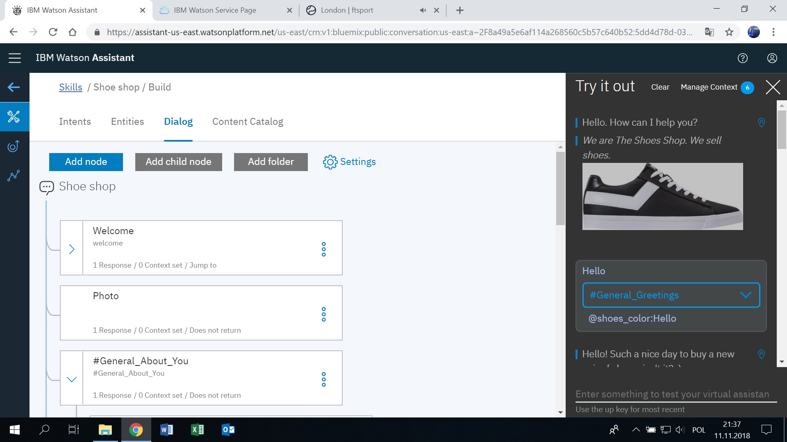
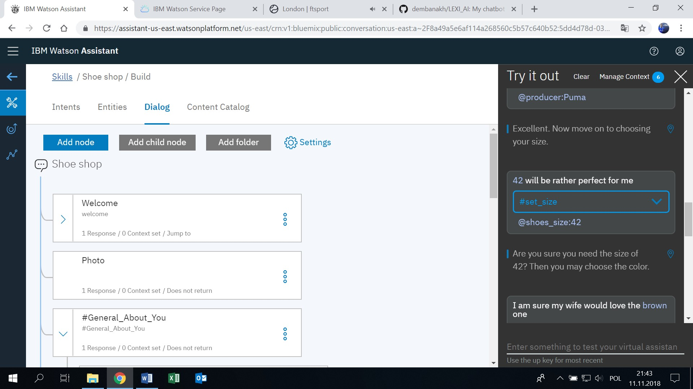
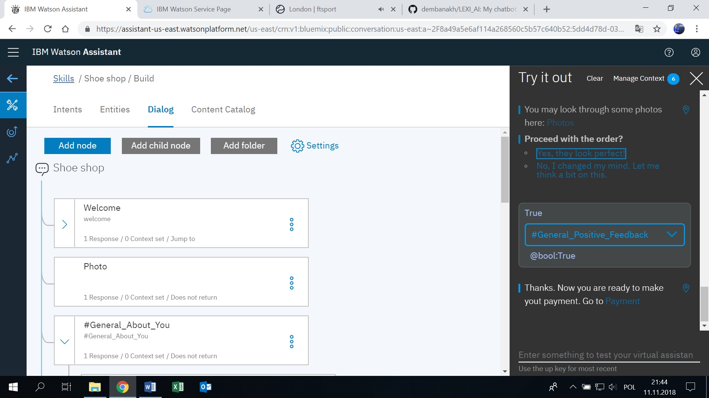

# A shoes shop bot

Entry for the LEXI AI Generation Contest organized by IBM in 2018, the task of which is to create a chatbot using IBM Watson Assistant tools. The bot was awarded National Winner in Poland.

Example Dialog:

